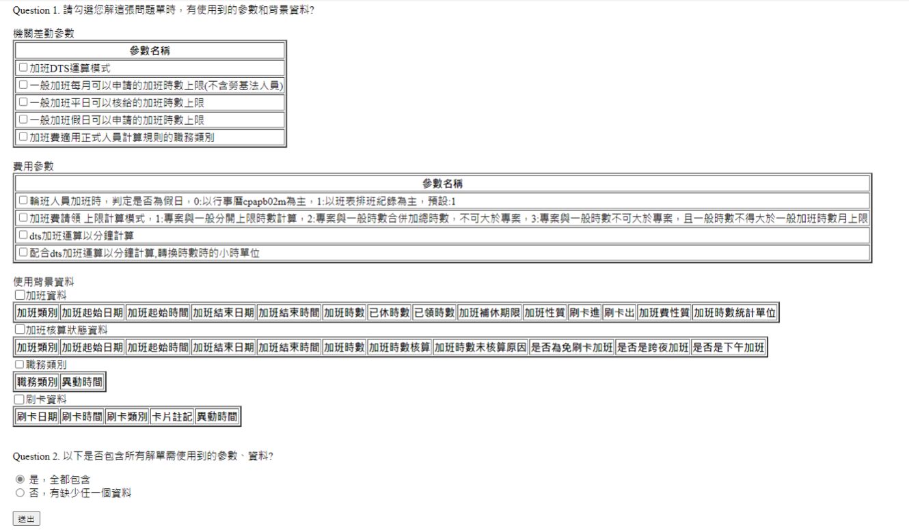
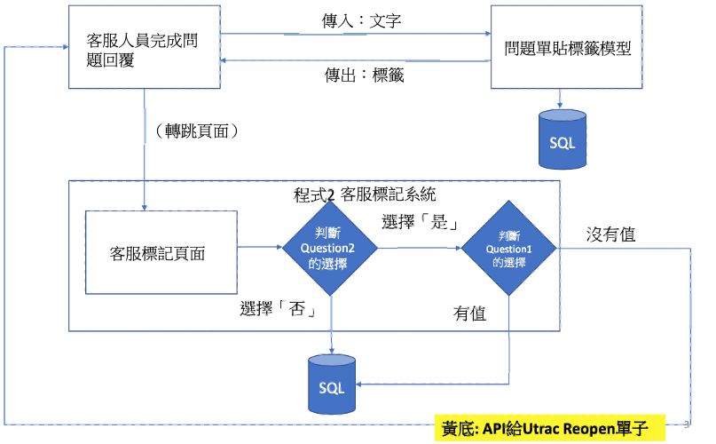

# 標籤確認系統
### 說明
為了加速標記資料收集的速度，提供自動問答系統的開發，
因此開發一個程式-「標籤確認系統」，讓客服人員協助標記資料；
當問題單關單後: 
(1) 「問題單貼標籤程式」將問題單貼標籤 
(2) 請資深客服人員協助確認問題單是否貼對標籤 

### 達成效果
在一個月內收集到3000張標記的資料，提供給自動問答系統作為訓練資料。

### 系統結構（檔案說明）

### 使用技術
Django＋apache
